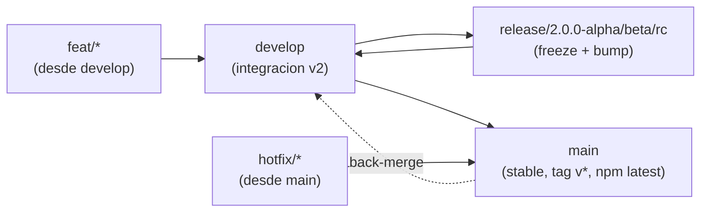

# Branch Workflow — Guia humana

> Para 4 devs, `1.x` congelado (`v1.2.0`), `v2.0.0` en train `alpha -> beta -> rc -> stable`. Ver ADR 0002 para la decision formal y ROADMAP.md para la filosofia SemVer.

## TL;DR

- **Nunca** pushees directo a `main` o `develop`.
- Crea `feat/*` desde `develop`, abre PR a `develop`.
- `release/*` solo la crea el release manager para congelar una version.
- `main` solo recibe `develop` (en `v2.0.0` estable) o `hotfix/*` (emergencia).

## El grafo



## Ramas

| Rama | Para que | Quien la toca | Cuanto vive |
|------|----------|---------------|-------------|
| `main` | Lo que ve el usuario (`npm create lumen`, `npm@latest`). | Solo via PR desde `develop` o `hotfix/*` | Para siempre |
| `develop` | Donde integramos los 4 devs. Siempre verde (`npm test` + `eslint`). | Todos, via `feat/*`/`release/*` | Para siempre |
| `release/2.0.0-alpha` | Foto congelada para estabilizar. Se bumpa `package.json` y `CHANGELOG.md`. Solo entran `fix` criticos. | Release manager | Dias/semanas |
| `feat/login-shadcn` | Tu feature. | Tu | Dias, se borra al mergear |
| `hotfix/1.2.1` | Emergencia en `main`. Se crea desde `main`, se mergea a `main` y luego a `develop`. | Quien arregla | Horas |

## Nombres

- `feat/<scope>-<descripcion>` ej `feat/manifest-v2`, `feat/tailwind-v4`
- `fix/<descripcion>` ej `fix/api-client-types`
- `release/2.0.0-alpha`, `release/2.0.0-beta.1`, `release/2.0.0-rc.1`, `release/2.1.0`
- `hotfix/<version>` ej `hotfix/2.0.1`
- `docs/<descripcion>`, `chore/<descripcion>`, `ci/<descripcion>` (no disparan bump)

Commits: Conventional Commits — `feat:`, `fix:`, `chore(release):`, `docs:`, `ci:` (historial actual: `chore(release): 1.2.0`).

## Como trabajar (paso a paso)

### 1. Empezar una feature (todos los dias, 4 devs en paralelo)

```bash
git checkout develop
git pull origin develop
git checkout -b feat/mi-feature
# ... codifica ...
npm test
npm run verify          # si tocas templates
git add -A && git commit -m "feat: mi feature"
git push -u origin feat/mi-feature
# Abre PR en GitHub: feat/mi-feature -> develop, espera review + CI verde (eslint)
```

> Regla: `feat/*` siempre nace de `develop`, nunca de `release/*`. Asi los 4 devs no se bloquean.

### 2. Sacar un alpha/beta/rc (solo release manager)

Cuando `develop` alcanza el DoD de un milestone (M1: `npm create lumen@alpha my-app` funciona, PLAN.md):

```bash
git checkout develop && git pull
git checkout -b release/2.0.0-alpha
# bump de version
npm version 2.0.0-alpha.0 --no-git-tag-version
# actualiza CHANGELOG.md [Unreleased] -> [2.0.0-alpha.0]
git commit -am "chore(release): 2.0.0-alpha.0"
git push -u origin release/2.0.0-alpha
# Solo fixes criticos desde ahora:
git checkout -b fix/ajuste release/2.0.0-alpha -> PR fix/* -> release/*
# Cuando verde (npm test + verify:full):
# PR release/2.0.0-alpha -> develop (mergea, preserva bump)
# Tag desde main o desde release: git tag v2.0.0-alpha.0 && git push origin v2.0.0-alpha.0
# publish.yml publica con npm publish --tag alpha y crea GitHub Release --prerelease
```

Dist-tags: `alpha` -> `npm create lumen@alpha`, `beta` -> `@beta`, `rc` -> `@rc`, `next` -> generico prerelease, `latest` -> estable.

### 3. Release estable `v2.0.0` (M5)

```bash
# develop ya tiene M1-M4
git checkout main && git pull
git merge develop --no-ff -m "chore(release): 2.0.0 stable"
# o PR develop -> main en GitHub
npm version 2.0.0 --no-git-tag-version
git tag v2.0.0 && git push origin main --tags
# publish.yml: npm publish (latest) + GitHub Release
```

### 4. Hotfix (solo si `main` tiene regression y no puede esperar a `develop`)

```bash
git checkout main && git pull
git checkout -b hotfix/2.0.1
# fix
git commit -m "fix: ..."
git push -u origin hotfix/2.0.1
# PR hotfix/2.0.1 -> main (tag v2.0.1), luego back-merge:
git checkout develop && git merge main
git push origin develop
```

## SemVer en 30 segundos (ROADMAP.md)

- `fix:` -> `2.0.1` (patch, no rompe nada)
- `feat:` aditivo (nuevo prompt/template/provider opcional) -> `2.1.0` (minor)
- Romper config schema, CLI flags, template contract, engine -> `3.0.0` (major, ver ROADMAP.md:45-62)
- `v1.x` -> `v2.0.0` es major porque el config plano pasa a nested (ROADMAP.md:314).

## Checklists

**Antes de abrir PR a `develop`:**
- [ ] `git pull --rebase origin develop`
- [ ] `npm test` verde
- [ ] `npx eslint bin src register.js` verde
- [ ] Si tocas `templates/`, `npm run verify` verde

**Antes de crear `release/*`:**
- [ ] `develop` verde en CI
- [ ] DoD del milestone cumplido (PLAN.md)
- [ ] `package.json` y `CHANGELOG.md` bumpeados

## Do / Don't

- DO: rebases frecuentes, PRs pequenos, borrar `feat/*` tras merge.
- DON'T: `feat -> release/*`, `feat -> main`, push directo a `main`/`develop`, dos `release/*` activas a la vez, dejar `release/*` sin back-merge a `develop`.

## Referencias

- ADR 0002: `docs/adr/0002-branching-strategy.md`
- Versionado: `docs/ROADMAP.md` (Versioning Philosophy)
- Plan `v2`: `docs/PLAN.md`
- CI: `.github/workflows/publish.yml`, `.github/workflows/eslint.yml`
