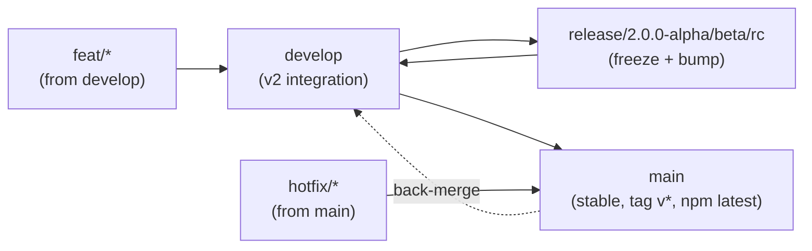

# Branch Workflow — Human Guide

> For 4 devs, `1.x` frozen (`v1.2.0`), `v2.0.0` train `alpha -> beta -> rc -> stable`. See ADR 0002 for the formal decision and ROADMAP.md for the SemVer philosophy.

## TL;DR

- **Never** push directly to `main` or `develop`.
- Create `feat/*` from `develop`, open a PR to `develop`.
- `release/*` is only created by the release manager to freeze a version.
- `main` only receives `develop` (at `v2.0.0` stable) or `hotfix/*` (emergency).

## Graph



## Branches

| Branch | Purpose | Who owns it | Lifetime |
|--------|---------|-------------|----------|
| `main` | What users see (`npm create lumen`, `npm@latest`). | Only via PR from `develop` or `hotfix/*` | Permanent |
| `develop` | Integration for 4 devs. Always green (`npm test` + `eslint`). | Everyone, via `feat/*`/`release/*` | Permanent |
| `release/2.0.0-alpha` | Frozen snapshot to stabilize. Bump `package.json` and `CHANGELOG.md`. Only critical `fix` allowed. | Release manager | Days/weeks |
| `feat/login-shadcn` | Your feature. | You | Days, deleted after merge |
| `hotfix/1.2.1` | Emergency on `main`. Created from `main`, merged to `main` then to `develop`. | Fix author | Hours |

## Naming

- `feat/<scope>-<description>` e.g. `feat/manifest-v2`, `feat/tailwind-v4`
- `fix/<description>` e.g. `fix/api-client-types`
- `release/2.0.0-alpha`, `release/2.0.0-beta.1`, `release/2.0.0-rc.1`, `release/2.1.0`
- `hotfix/<version>` e.g. `hotfix/2.0.1`
- `docs/<description>`, `chore/<description>`, `ci/<description>` (no version bump)

Commits: Conventional Commits — `feat:`, `fix:`, `chore(release):`, `docs:`, `ci:` (current history: `chore(release): 1.2.0`).

## How to work (step by step)

### 1. Start a feature (daily, 4 devs in parallel)

```bash
git checkout develop
git pull origin develop
git checkout -b feat/my-feature
# ... code ...
npm test
npm run verify          # if you touched templates
git add -A && git commit -m "feat: my feature"
git push -u origin feat/my-feature
# Open PR on GitHub: feat/my-feature -> develop, wait for review + green CI (eslint)
```

> Rule: `feat/*` always branches from `develop`, never from `release/*`. This keeps 4 devs unblocked.

### 2. Cut an alpha/beta/rc (release manager only)

When `develop` reaches a milestone DoD (M1: `npm create lumen@alpha my-app` works, see PLAN.md):

```bash
git checkout develop && git pull
git checkout -b release/2.0.0-alpha
# bump version
npm version 2.0.0-alpha.0 --no-git-tag-version
# update CHANGELOG.md [Unreleased] -> [2.0.0-alpha.0]
git commit -am "chore(release): 2.0.0-alpha.0"
git push -u origin release/2.0.0-alpha
# Only critical fixes from now on:
git checkout -b fix/tweak release/2.0.0-alpha -> PR fix/* -> release/*
# When green (npm test + verify:full):
# PR release/2.0.0-alpha -> develop (merge, keep bump)
# Tag from main or release: git tag v2.0.0-alpha.0 && git push origin v2.0.0-alpha.0
# publish.yml publishes with npm publish --tag alpha and creates GitHub prerelease
```

Dist-tags: `alpha` -> `npm create lumen@alpha`, `beta` -> `@beta`, `rc` -> `@rc`, `next` -> generic prerelease, `latest` -> stable.

### 3. Stable release `v2.0.0` (M5)

```bash
# develop already has M1-M4
git checkout main && git pull
git merge develop --no-ff -m "chore(release): 2.0.0 stable"
# or PR develop -> main on GitHub
npm version 2.0.0 --no-git-tag-version
git tag v2.0.0 && git push origin main --tags
# publish.yml: npm publish (latest) + GitHub Release
```

### 4. Hotfix (only if `main` has a regression that cannot wait for `develop`)

```bash
git checkout main && git pull
git checkout -b hotfix/2.0.1
# fix
git commit -m "fix: ..."
git push -u origin hotfix/2.0.1
# PR hotfix/2.0.1 -> main (tag v2.0.1), then back-merge:
git checkout develop && git merge main
git push origin develop
```

## SemVer in 30 seconds (ROADMAP.md)

- `fix:` -> `2.0.1` (patch, no breaking change)
- `feat:` additive (new optional prompt/template/provider) -> `2.1.0` (minor)
- Breaking config schema, CLI flags, template contract, engine -> `3.0.0` (major, see ROADMAP.md:45-62)
- `v1.x` -> `v2.0.0` is major because the flat config becomes nested (ROADMAP.md:314).

## Checklists

**Before opening a PR to `develop`:**
- [ ] `git pull --rebase origin develop`
- [ ] `npm test` green
- [ ] `npx eslint bin src register.js` green
- [ ] If you touched `templates/`, `npm run verify` green

**Before creating `release/*`:**
- [ ] `develop` green in CI
- [ ] Milestone DoD met (PLAN.md)
- [ ] `package.json` and `CHANGELOG.md` bumped

## Do / Don't

- DO: frequent rebases, small PRs, delete `feat/*` after merge.
- DON'T: `feat -> release/*`, `feat -> main`, direct push to `main`/`develop`, two active `release/*` at once, leave `release/*` without back-merge to `develop`.

## References

- ADR 0002: `docs/adr/0002-branching-strategy.md`
- Versioning: `docs/ROADMAP.md` (Versioning Philosophy)
- Plan `v2`: `docs/PLAN.md`
- CI: `.github/workflows/publish.yml`, `.github/workflows/eslint.yml`
