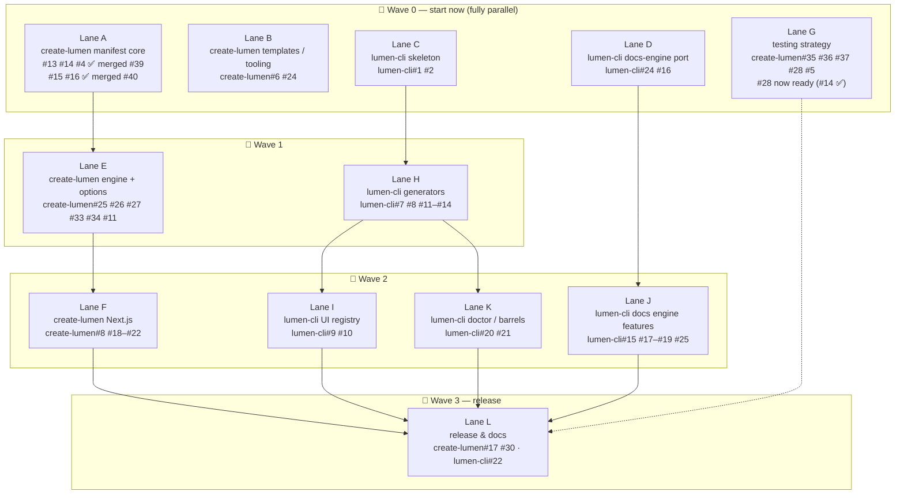
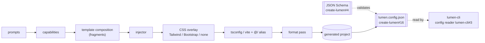
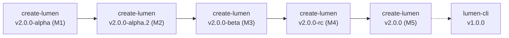

# v2 Plan — diagrams

Visual companion to [`ROADMAP.md`](./ROADMAP.md). All references use
`repo#issue` — e.g. `create-lumen#13`, `lumen-cli#3`. All diagrams render
on GitHub.

## 1. Functional milestones

Each milestone closes with an observable result; no waiting for the
90%-assembled scaffold.

```mermaid
flowchart LR
    M1["🧱 M1 · v2.0.0-alpha<br/>Core: React/Vite + manifest v2"]
    M2["⚙️ M2 · v2.0.0-alpha.2<br/>Engine: capabilities + options"]
    M3["▲ M3 · v2.0.0-beta<br/>Next.js support"]
    M4["🧪 M4 · v2.0.0-rc<br/>Testing &amp; quality"]
    M5["📦 M5 · v2.0.0<br/>Docs &amp; release"]

    M1 -->|"npm create lumen@alpha my-app works"| M2
    M2 -->|"composed templates + shadcn/none/hybrid"| M3
    M3 -->|"Next.js scaffolds and runs"| M4
    M4 -->|"scalable tests + headless e2e"| M5
    M5 -->|"v2.0.0 stable"| DONE(((✅)))
```

## 2. Dependency graph (cross-project)

Solid arrows = hard dependency. Dotted arrows = cross-repo dependency
from `create-lumen` to `lumen-cli`. Green fill = merged (done). ✅ in text without fill = unblocked, ready to do.

```mermaid
flowchart TD
    subgraph CL["create-lumen v2"]
        direction TB
        CreateLumen13["✅ create-lumen#13 · nested schema<br/>merged #39 b423dc9"]
        CreateLumen14["✅ create-lumen#14 · Zod validator<br/>merged #39"]
        CreateLumen15["✅ create-lumen#15 · path mapping<br/>merged #40"]
        CreateLumen16["✅ create-lumen#16 · emit lumen.config.json<br/>merged #40"]
        CreateLumen4["✅ create-lumen#4 · publish JSON Schema<br/>merged #39"]
        CreateLumen9["✅ create-lumen#9 · shared contract<br/>unblocked (needs #13 ✅)"]
        CreateLumen6["create-lumen#6 · Tailwind v4"]
        CreateLumen24["create-lumen#24 · tooling parity"]
        CreateLumen23["create-lumen#23 · validate React/Vite under v2"]
        CreateLumen29["create-lumen#29 · non-interactive flags<br/>needs #16"]
        CreateLumen31["create-lumen#31 · CI pre-releases<br/>needs #16 #23"]
        CreateLumen25["✅ create-lumen#25 · capability model<br/>unblocked (needs #13 ✅)"]
        CreateLumen26["create-lumen#26 · gate prompts"]
        CreateLumen27["create-lumen#27 · template composition"]
        CreateLumen33["create-lumen#33 · shadcn/ui"]
        CreateLumen34["create-lumen#34 · architecture none/hybrid"]
        CreateLumen8["create-lumen#8 · Next.js epic"]
        CreateLumenNext["create-lumen#18–#22 · Next.js tasks"]
        CreateLumen35["create-lumen#35 · testing epic"]
        CreateLumen36["create-lumen#36 · pairwise/t-way"]
        CreateLumen37["create-lumen#37 · per-overlay contract tests"]
        CreateLumen28["✅ create-lumen#28 · schema fixtures<br/>unblocked (needs #14 ✅)"]
        CreateLumen5["create-lumen#5 · headless e2e"]
        CreateLumen17["create-lumen#17 · migration guide"]

        CreateLumen13 --> CreateLumen14 --> CreateLumen16
        CreateLumen13 --> CreateLumen15 --> CreateLumen16
        CreateLumen13 --> CreateLumen4
        CreateLumen13 --> CreateLumen9
        CreateLumen13 --> CreateLumen25 --> CreateLumen26 --> CreateLumen27
        CreateLumen6 --> CreateLumen23
        CreateLumen24 --> CreateLumen23
        CreateLumen16 --> CreateLumen23 --> CreateLumen31
        CreateLumen16 --> CreateLumen29 --> CreateLumen5
        CreateLumen16 --> CreateLumen17
        CreateLumen14 --> CreateLumen28
        CreateLumen27 --> CreateLumen33
        CreateLumen27 --> CreateLumen34
        CreateLumen27 --> CreateLumen8 --> CreateLumenNext
        CreateLumen35 --> CreateLumen36
        CreateLumen35 --> CreateLumen37

        style CreateLumen13 fill:#c6f6d5,stroke:#0e8a16,stroke-width:2px
        style CreateLumen14 fill:#c6f6d5,stroke:#0e8a16,stroke-width:2px
        style CreateLumen15 fill:#c6f6d5,stroke:#0e8a16,stroke-width:2px
        style CreateLumen16 fill:#c6f6d5,stroke:#0e8a16,stroke-width:2px
        style CreateLumen4 fill:#c6f6d5,stroke:#0e8a16,stroke-width:2px
        style CreateLumen9 stroke:#0e8a16,stroke-width:2px,fill:#fff
        style CreateLumen25 stroke:#0e8a16,stroke-width:2px,fill:#fff
        style CreateLumen28 stroke:#0e8a16,stroke-width:2px,fill:#fff
    end

    subgraph LC["lumen-cli v1"]
        direction TB
        LumenCli1["lumen-cli#1 · bootstrap"]
        LumenCli2["lumen-cli#2 · command framework"]
        LumenCli3["lumen-cli#3 · config reader"]
        LumenCli4["lumen-cli#4 · lumen config"]
        LumenCli5["lumen-cli#5 · create/init"]
        LumenCli6["lumen-cli#6 · forward tooling flags"]
        LumenCli7["lumen-cli#7 · generator core"]
        LumenCliGen["lumen-cli#8 #11–#14 · generators"]
        LumenCli9["lumen-cli#9 · ui registry"]
        LumenCli10["lumen-cli#10 · themes"]
        LumenCli24["lumen-cli#24 · port documentador"]
        LumenCli16["lumen-cli#16 · python bridge"]
        LumenCliDocs["lumen-cli#15 #17–#19 #25 · docs"]
        LumenCli20["lumen-cli#20 · doctor"]
        LumenCli21["lumen-cli#21 · sync-barrels"]

        LumenCli1 --> LumenCli2
        LumenCli2 --> LumenCli3 --> LumenCli7
        LumenCli3 --> LumenCli4
        LumenCli3 --> LumenCli20
        LumenCli7 --> LumenCliGen
        LumenCli7 --> LumenCli9 --> LumenCli10
        LumenCli7 --> LumenCli21
        LumenCli24 --> LumenCli16 --> LumenCliDocs
        LumenCli2 --> LumenCli5 --> LumenCli6
    end

    CreateLumen9 -.-> LumenCli3
    CreateLumen13 -.-> LumenCli3
    CreateLumen33 -.-> LumenCli9
    CreateLumen16 -.-> LumenCli5
```

## 3. Parallel work — waves (4 devs)

Everything in a wave can run at the same time.

Suggested split: **Dev 1** A→E→F · **Dev 2** B→G→L · **Dev 3**
C→H→I→K · **Dev 4** D→J.

## 4. v2 generation pipeline

How a scaffold is produced once the engine (M2) lands.

## 5. Release train

