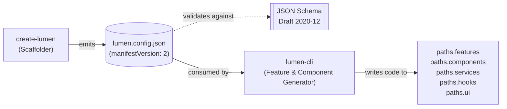

# Manifest & Template Contract: `create-lumen` ↔ `lumen-cli`

> **Contract Version:** 2  
> **Status:** Stable (M1 / v2.0.0-alpha)  
> **Tracking Issues:** `create-lumen#9`, `create-lumen#13`, `create-lumen#15`, `lumen-cli#3`

This document defines the formal, versioned contract between **`create-lumen`** (the project scaffolder that produces initial repositories and emits `lumen.config.json`) and **`lumen-cli`** (the ongoing companion CLI that reads `lumen.config.json` to generate components, features, hooks, services, and run diagnostics).

---

## 1. Architecture Overview



- **Producer (`create-lumen`):** Assembles initial project templates and writes a deterministic, schema-compliant `lumen.config.json` at the project root.
- **Consumer (`lumen-cli`):** Inspects `lumen.config.json` before performing generator tasks (`lumen g component`, `lumen g feature`, `lumen doctor`). `lumen-cli` must **never** hardcode target directories; it must resolve all paths through `manifest.paths`.

---

## 2. Manifest v2 Specification

Every emitted manifest MUST conform to the [JSON Schema Draft 2020-12](https://lumen-sh.github.io/create-lumen/schema/lumen.config.v2.json) and Zod schema in `src/manifest/schema.js`.

### Top-Level Schema

```typescript
interface ManifestV2 {
  $schema?: string;                 // Default: "https://lumen-sh.github.io/create-lumen/schema/lumen.config.v2.json"
  manifestVersion: 2;               // Literal 2 (required)
  framework: FrameworkConfig;       // Required
  styling: StylingConfig;           // Required
  architecture: ArchitectureConfig; // Required
  ui: UIConfig;                     // Required
  docs: DocsConfig;                 // Required
  paths: PathsConfig;               // Required
  tooling: ToolingConfig;           // Required
  reactCompiler?: boolean;          // Optional
  agentDocs?: boolean;              // Optional
}
```

### Sub-Schema Definitions

#### Framework (`framework`)
```typescript
interface FrameworkConfig {
  name: "react" | "next";
  variant: "vite" | "app-router" | "pages-router";
  bundler?: "turbopack" | "webpack";              // Only valid when name === "next"
  adapter?: "node" | "vercel" | "cloudflare" | "static"; // Only valid when name === "next"
}
```
*Constraints:*
- When `name === "react"`, `variant` MUST be `"vite"`.
- When `name === "next"`, `variant` MUST be `"app-router"` or `"pages-router"`.
- `bundler` and `adapter` are prohibited when `name === "react"`.

#### Styling (`styling`)
```typescript
interface StylingConfig {
  engine: "tailwind" | "bootstrap" | "none";
}
```
*Notes:* In v2, `engine: "tailwind"` implies **Tailwind CSS v4** (CSS-first `@theme`, no `tailwind.config.js`).

#### Architecture (`architecture`)
```typescript
interface ArchitectureConfig {
  type: "feature-based" | "type-based" | "hybrid" | "none";
}
```
*Constraints:*
- For `framework.name === "react"`, allowed types are: `"feature-based"`, `"type-based"`, `"none"`.
- For `framework.name === "next"`, allowed types are: `"feature-based"`, `"hybrid"`, `"none"` (Next.js supports `hybrid` instead of `type-based`).

#### UI Kit (`ui`)
```typescript
interface UIConfig {
  kit: "shadcn" | "none";
}
```
*Constraints:*
- `kit: "shadcn"` REQUIRES `styling.engine === "tailwind"`.

#### Documentation (`docs`)
```typescript
interface DocsConfig {
  language: "en" | "es";
}
```

#### Tooling (`tooling`)
```typescript
interface ToolingConfig {
  language: "ts" | "js";
  linter: "eslint" | "oxlint" | "biome" | "none";
  formatter: "prettier" | "oxfmt" | "none";
}
```

---

## 3. Path Resolution Contract

`paths` provides the exact relative directory targets from the project root using POSIX separators (`/`).

```typescript
interface PathsConfig {
  features: string;    // Directory for modular feature boundaries
  components: string;  // Shared or central component directory
  services: string;    // API and external service integrations
  hooks: string;       // Reusable custom React hooks
  pages: string;       // Route entries / pages directory
  ui: string;          // Primitive UI components (e.g. shadcn buttons)
}
```

### Guaranteed Mappings

| Framework | Architecture | `features` | `components` | `services` | `hooks` | `pages` | `ui` |
| :--- | :--- | :--- | :--- | :--- | :--- | :--- | :--- |
| **React + Vite** | `feature-based` | `src/features` | `src/shared/components` | `src/shared/services` | `src/shared/hooks` | `src/app/router` | `src/shared/components/ui` |
| **React + Vite** | `type-based` | `src/features` | `src/components` | `src/services` | `src/hooks` | `src/pages` | `src/ui` |
| **React + Vite** | `none` | `src` | `src` | `src` | `src` | `src` | `src` |
| **Next.js (App)** | `feature-based` | `src/features` | `src/shared/components` | `src/shared/services` | `src/shared/hooks` | `app` | `src/shared/components/ui` |
| **Next.js (App)** | `hybrid` | `src/features` | `src/shared/components` | `src/shared/services` | `src/shared/hooks` | `app` | `src/shared/components/ui` |
| **Next.js (Pages)**| `feature-based` | `src/features` | `src/shared/components` | `src/shared/services` | `src/shared/hooks` | `pages` | `src/shared/components/ui` |

### Consumer Rule:
Generators in `lumen-cli` MUST construct file paths by prepending project root to `manifest.paths.<target>`. No hardcoded `'src/components'` or assumptions about layout may be made in generator implementations.

---

## 4. Template & Code Generation Contract

When `lumen-cli` generates files into a project, it MUST respect the following code generation conventions:

### 1. File Extensions
- If `tooling.language === "ts"`:
  - React components / JSX: `.tsx`
  - Pure TypeScript logic / stores / services: `.ts`
- If `tooling.language === "js"`:
  - React components / JSX: `.jsx`
  - Pure JavaScript logic: `.js`

### 2. Feature Structure & Public Barrels
When generating a new feature module under `paths.features` (e.g., `src/features/billing`):
- Internal subfolders:
  - `components/` — Feature-private components
  - `hooks/` — Feature-private hooks
  - `layouts/` — Feature layouts
  - `pages/` — Feature page components
  - `services/` — Feature data-fetching / APIs
  - `store/` — Feature state slices (Zustand/Redux)
  - `types/` — Feature types
- **Public Barrel:**
  Every feature MUST export its public API from a barrel index file at its root:
  - `src/features/<feature-name>/index.ts` (or `.js`)
  - Consumers outside the feature MUST only import from this barrel (e.g. `@/features/billing`), preserving encapsulation.

### 3. Path Alias Guarantee
Both `create-lumen` templates and `lumen-cli` generator templates rely on the path alias:
- `@/*` is guaranteed to resolve to `<root>/src/*` (or `<root>/*` for flat setups) via `tsconfig.json` / `jsconfig.json` and Vite / Next bundler configuration.
- Shared resources must be imported via `@/shared/...` (in feature-based) or `@/...` (in type-based).

---

## 5. Version Negotiation & Breaking Changes

### Version Field
- The manifest contains `manifestVersion: 2` (integer).
- `create-lumen` 2.x only emits `manifestVersion: 2`.
- `lumen-cli` 1.x / 2.x only operates on projects where `manifestVersion === 2`.

### Strict v1 Rejection
When `lumen-cli` or `create-lumen` encounters a manifest lacking `manifestVersion: 2` or using the flat v1 schema:
1. It MUST fail immediately with an exit code of `1`.
2. It MUST print a migration-oriented error message directing the developer to `docs/migration/v1-to-v2.md`.
3. It MUST NOT perform partial code generation or mutate existing files.

### Protocol for Future Breaking Changes
If the schema or contract must introduce a breaking change in the future:
1. The version integer MUST be incremented (`manifestVersion: 3`).
2. An Architecture Decision Record (ADR) MUST be recorded in `docs/adr/`.
3. A migration guide MUST be published under `docs/migration/`.
4. `lumen.config.v<N>.json` schema MUST be generated and published with the new version.

---

## 6. Shared Fixtures Contract

The contract between `create-lumen` and `lumen-cli` is validated across repos using standardized fixtures representing the canonical permutations:
- `react-vite-feature-ts.json`
- `react-vite-type-based.json`
- `react-vite-none-js.json`
- `next-app-feature-ts.json`
- `next-app-hybrid-ts.json`
- `next-pages-feature-ts.json`

Both repositories assert that:
- `create-lumen` `buildManifest()` produces fixtures matching this schema.
- `lumen-cli` configuration parser consumes these fixtures without error or loss of resolution.

---

## References

- [v1 to v2 Migration Guide](../migration/v1-to-v2.md)
- [Manifest v2 Details](../manifest-v2.md)
- [JSON Schema](../../schema/lumen.config.v2.json)
- [Source Validator](../../src/manifest/schema.js)
- [Source Path Mapping](../../src/manifest/paths.js)
