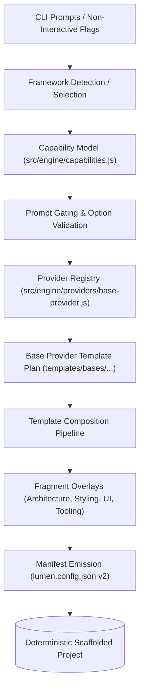
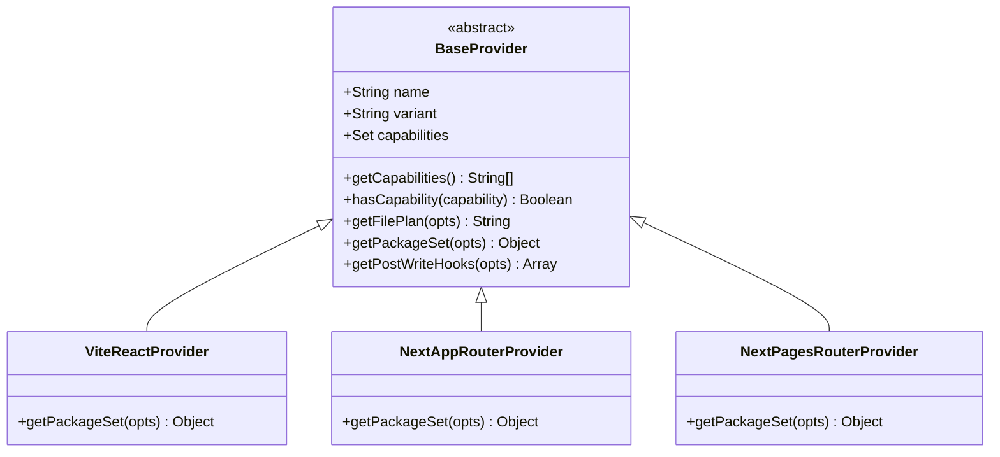
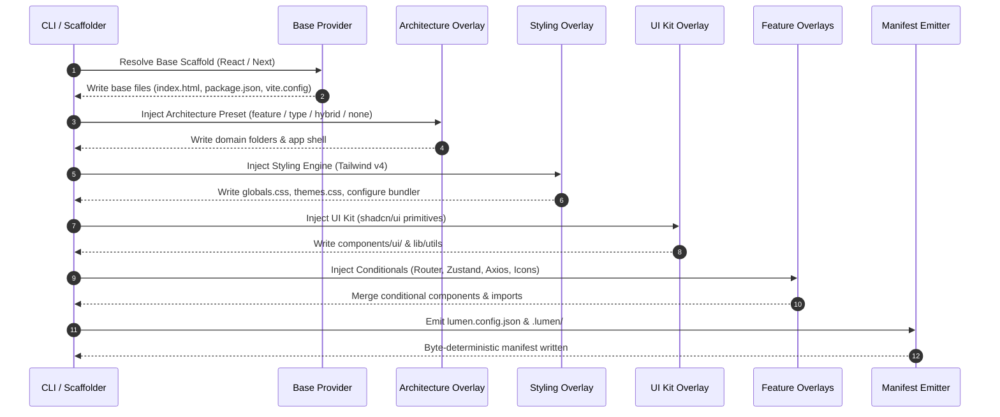

# Generator Engine & Capabilities Guide (M2)

> **Milestone:** M2 (`v2.0.0-alpha.2`)  
> **Status:** Implemented / Completed  
> **Related Issues:** `#10` (Capabilities Epic), `#25` (Capability Model), `#38` (BaseProvider Seam), `#26` (Prompt Gating), `#27` (Template Composition), `#33` (shadcn/ui), `#34` (none/hybrid Architectures), `#51` (Drop Bootstrap), `#48` (M2 Documentation)  
> **Related ADR:** [ADR 0001: Scaffolder Base Strategy](./adr/0001-scaffolder-base-strategy.md)

---

## Table of Contents

1. [Architectural Overview & Evolution](#1-architectural-overview--evolution)
2. [Capability Model (`src/engine/capabilities.js`)](#2-capability-model-srcenginecapabilitiesjs)
   - [Capability Flags (`CAPABILITIES`)](#capability-flags-capabilities)
   - [Framework Descriptors (`FRAMEWORK_CAPABILITIES`)](#framework-descriptors-framework_capabilities)
   - [Engine Compatibility & Query API](#engine-compatibility--query-api)
   - [Prompt Gating & Response Sanitization](#prompt-gating--response-sanitization)
3. [BaseProvider Seam & Registry (`src/engine/providers/base-provider.js`)](#3-baseprovider-seam--registry-srcengineprovidersbase-providerjs)
   - [Abstract BaseProvider Contract](#abstract-baseprovider-contract)
   - [Concrete Providers](#concrete-providers)
   - [Provider Registry](#provider-registry)
4. [Template Composition Pipeline](#4-template-composition-pipeline)
   - [Cartesian Matrix vs Composable Fragments](#cartesian-matrix-vs-composable-fragments)
   - [Layered Assembly Pipeline](#layered-assembly-pipeline)
   - [Hermetic & Deterministic Generation](#hermetic--deterministic-generation)
5. [Architecture Presets (`none` and `hybrid`)](#5-architecture-presets-none-and-hybrid)
   - [Preset Matrix](#preset-matrix)
   - [The `none` Architecture Preset](#the-none-architecture-preset)
   - [The `hybrid` Architecture Preset](#the-hybrid-architecture-preset)
   - [Path Mappings & Validation Modes](#path-mappings--validation-modes)
6. [shadcn/ui Integration Guide](#6-shadcnui-integration-guide)
   - [Tailwind CSS v4 CSS-First Theming](#tailwind-css-v4-css-first-theming)
   - [Scaffolded Primitives & Utilities](#scaffolded-primitives--utilities)
   - [Dark Mode & Theme Synchronization](#dark-mode--theme-synchronization)
   - [Adding New Components](#adding-new-components)
7. [Bootstrap Removal & Migration Guide (#51)](#7-bootstrap-removal--migration-guide-51)
   - [Rationale for Removal](#rationale-for-removal)
   - [Class & Component Mapping](#class--component-mapping)
   - [Migrating Custom Themes & SCSS](#migrating-custom-themes--scss)
8. [CLI Invocation Standards](#8-cli-invocation-standards)
   - [Release Channels & Tags](#release-channels--tags)
   - [Non-Interactive & Headless Scaffolding](#non-interactive--headless-scaffolding)
   - [Agent Interoperability Guidelines](#agent-interoperability-guidelines)

---

## 1. Architectural Overview & Evolution

In `v1.x`, `create-lumen` scaffolded projects using a monolithic, cross-product mental model: every generator option (language, CSS framework, router, state management, test runner, linter, formatter) was evaluated across a flat permutation space. While workable for a single target (React + Vite), this design resulted in an combinatorial explosion of ~11,664 potential permutation cells.

With Milestone 2 (`v2.0.0-alpha.2`) and the multi-framework roadmap (leading to Next.js in M3 and SvelteKit in v3), the flat permutation model broke down:
- Next.js does not use React Router or external client routers; filesystem routing is intrinsic.
- Next.js exposes concepts absent from Vite (Server Components, Route Handlers, Turbopack/Webpack bundler choice, deployment adapters).
- UI kits such as `shadcn/ui` depend strictly on utility-first Tailwind CSS v4 and cannot be paired with vanilla CSS or legacy Bootstrap.

M2 resolves this by replacing the cartesian matrix with a **Capabilities-Driven Composition Engine** (ADR 0001, create-lumen#25, #10). The architecture decouples capability definitions from CLI prompts, evaluates framework compatibility upfront, and composes projects from repository-owned base templates plus layered feature fragments.



---

## 2. Capability Model (`src/engine/capabilities.js`)

The capability model serves as the single source of truth for what each framework target supports. Rather than embedding ad-hoc `if (framework === "next")` statements throughout prompt files and template injectors, generator behavior is governed by feature flags and declared compatibility domains.

### Capability Flags (`CAPABILITIES`)

The `CAPABILITIES` constant in [`src/engine/capabilities.js`](file:///C:/Users/josed/orca/workspaces/create-lumen/alpha2-e-integration/src/engine/capabilities.js) defines atomic capabilities:

```javascript
export const CAPABILITIES = {
  CLIENT_ROUTING: "client-routing",       // Client-side declarative routing (e.g. React Router)
  FILESYSTEM_ROUTING: "filesystem-routing", // File-based conventions (Next.js app/pages)
  SERVER_COMPONENTS: "server-components",   // React Server Components (RSC)
  CLIENT_COMPONENTS: "client-components",   // Standard interactive client components ("use client")
  ROUTE_HANDLERS: "route-handlers",         // Server-side route handlers / endpoints
  API_ROUTES: "api-routes",                 // Next.js Pages Router api/ routes
  ADAPTERS: "adapters",                     // Deployment targets (Node, Vercel, Cloudflare, static)
  BUNDLER_SELECTION: "bundler-selection",   // Bundler choice (Turbopack, Webpack, Vite)
  REACT_COMPILER: "react-compiler",         // React 19 compiler optimization
  NEXT_FONT: "next-font",                   // Built-in font optimization
  NEXT_IMAGE: "next-image",                 // Built-in image optimization
  SPA_FALLBACK: "spa-fallback",             // Single Page Application rewrite fallback
  AGENT_DOCS: "agent-docs",                 // LLM context scaffolding (.lumen/ directory)
};
```

### Framework Descriptors (`FRAMEWORK_CAPABILITIES`)

Each supported framework variant defines a capability descriptor declaring its capabilities and permitted option values:

```javascript
export const FRAMEWORK_CAPABILITIES = {
  "react:vite": {
    framework: { name: "react", variant: "vite" },
    capabilities: [
      CAPABILITIES.CLIENT_ROUTING,
      CAPABILITIES.CLIENT_COMPONENTS,
      CAPABILITIES.SPA_FALLBACK,
      CAPABILITIES.AGENT_DOCS,
    ],
    allowedArchitectures: ["feature-based", "type-based", "none"],
    allowedStyling: ["tailwind", "none"],
    allowedUiKits: ["shadcn", "none"],
    allowedLanguages: ["ts", "js"],
    allowedLinters: ["eslint", "oxlint", "biome", "none"],
    allowedFormatters: ["prettier", "oxfmt", "none"],
    allowedBundlers: [],
    allowedAdapters: [],
    supportsRouterPrompt: true,
  },
  "next:app-router": {
    framework: { name: "next", variant: "app-router" },
    capabilities: [
      CAPABILITIES.FILESYSTEM_ROUTING,
      CAPABILITIES.SERVER_COMPONENTS,
      CAPABILITIES.CLIENT_COMPONENTS,
      CAPABILITIES.ROUTE_HANDLERS,
      CAPABILITIES.ADAPTERS,
      CAPABILITIES.BUNDLER_SELECTION,
      CAPABILITIES.REACT_COMPILER,
      CAPABILITIES.NEXT_FONT,
      CAPABILITIES.NEXT_IMAGE,
      CAPABILITIES.AGENT_DOCS,
    ],
    allowedArchitectures: ["feature-based", "hybrid", "none"],
    allowedStyling: ["tailwind", "none"],
    allowedUiKits: ["shadcn", "none"],
    allowedLanguages: ["ts", "js"],
    allowedLinters: ["eslint", "biome", "none"],
    allowedFormatters: ["prettier", "none"],
    allowedBundlers: ["turbopack", "webpack"],
    allowedAdapters: ["node", "vercel", "cloudflare", "static"],
    supportsRouterPrompt: false, // filesystem routing is built-in
  },
  "next:pages-router": {
    framework: { name: "next", variant: "pages-router" },
    capabilities: [
      CAPABILITIES.FILESYSTEM_ROUTING,
      CAPABILITIES.CLIENT_COMPONENTS,
      CAPABILITIES.API_ROUTES,
      CAPABILITIES.ADAPTERS,
      CAPABILITIES.BUNDLER_SELECTION,
      CAPABILITIES.NEXT_FONT,
      CAPABILITIES.NEXT_IMAGE,
      CAPABILITIES.AGENT_DOCS,
    ],
    allowedArchitectures: ["feature-based", "hybrid", "none"],
    allowedStyling: ["tailwind", "none"],
    allowedUiKits: ["shadcn", "none"],
    allowedLanguages: ["ts", "js"],
    allowedLinters: ["eslint", "biome", "none"],
    allowedFormatters: ["prettier", "none"],
    allowedBundlers: ["turbopack", "webpack"],
    allowedAdapters: ["node", "vercel", "cloudflare", "static"],
    supportsRouterPrompt: false,
  },
};
```

### Engine Compatibility & Query API

The capability engine provides functional query utilities used across prompts, injectors, and CLI argument parsers:

| Function | Signature | Purpose |
| :--- | :--- | :--- |
| `getFrameworkKey` | `(name: string, variant: string) => string` | Canonical lookup key (e.g. `"react:vite"`, `"next:app-router"`). |
| `getFrameworkDescriptor` | `(framework: object) => object \| null` | Fetches the full capability descriptor for a framework object. |
| `hasCapability` | `(framework: object, capability: string) => boolean` | Tests whether a target supports a specific capability. |
| `isOptionCompatible` | `(framework: object, optionKey: string, optionValue: any) => boolean` | Validates an individual option value against allowed sets. Handles routing checks and legacy aliases. |
| `getCompatibleOptions` | `(framework: object) => object \| null` | Returns all valid domains (architectures, styling, bundlers, etc.) for dynamic prompt construction. |
| `validateCompatibility` | `(framework: object, options: object) => { valid: boolean, errors: string[] }` | Batch validator for CLI options or parsed manifests. Returns human-readable error messages for incompatibilities. |

### Prompt Gating & Response Sanitization

Interactive prompts dynamically adapt to framework capabilities using gating helpers:

- **`normalizeFramework(framework)`**: Converts user strings (e.g. `"react"`, `"next"`, `"next:app-router"`) or objects into a canonical `{ name, variant }` structure.
- **`isPromptVisible(framework, promptName)`**: Gates prompts dynamically. For example, `isPromptVisible(fw, "router")` checks `CLIENT_ROUTING` capability and `supportsRouterPrompt`; for Next.js, this returns `false`, preventing the redundant "Would you like to install React Router?" prompt.
- **`filterCompatibleChoices(framework, optionKey, choices)`**: Filters choices presented in `@clack/prompts` menus. For instance, when scaffolding for Next.js, `type-based` is removed from architecture options, while `hybrid` is included.
- **`getDefaultResponses(framework, options)`**: Yields sensible defaults for quick setup (`-y` / `--yes`) customized per target framework.
- **`sanitizeResponsesForFramework(framework, responses)`**: Harmonizes prompt or configuration inputs against framework capabilities, safely resolving conflicting flags.

---

## 3. BaseProvider Seam & Registry (`src/engine/providers/base-provider.js`)

To decouple concrete framework behaviors from generator orchestration, Lumen introduces an extensible Provider seam ([`src/engine/providers/base-provider.js`](file:///C:/Users/josed/orca/workspaces/create-lumen/alpha2-e-integration/src/engine/providers/base-provider.js)).

### Abstract BaseProvider Contract

`BaseProvider` defines the polymorphic lifecycle contract for generator targets:

```javascript
export class BaseProvider {
  /**
   * @param {object} config
   * @param {string} config.name - framework name (e.g. "react", "next")
   * @param {string} config.variant - framework variant (e.g. "vite", "app-router")
   * @param {string[]} [config.capabilities]
   */
  constructor({ name, variant, capabilities = [] }) {
    if (new.target === BaseProvider) {
      throw new TypeError("Cannot instantiate abstract BaseProvider directly");
    }
    this.name = name;
    this.variant = variant;
    this.capabilities = new Set(capabilities);
  }

  getCapabilities() { ... }
  hasCapability(capability) { ... }
  
  /**
   * Pattern: templates/bases/<provider>/<variant>/<lang>/
   */
  getFilePlan({ lang = "ts" } = {}) { ... }
  
  /**
   * Returns base dependencies and devDependencies.
   */
  getPackageSet(options = {}) { ... }
  
  /**
   * Returns post-write lifecycle hooks (e.g. build triggers, config writes).
   */
  getPostWriteHooks(options = {}) { ... }
}
```



### Concrete Providers

1. **`ViteReactProvider`**:
   - Manages React 19 + Vite 6 toolchain.
   - Supplies `@vitejs/plugin-react`, `typescript`, `@types/react`, and `@types/react-dom`.
   - File plan points to `templates/bases/react/vite/<lang>`.

2. **`NextAppRouterProvider`**:
   - Manages Next.js 15+ App Router baseline.
   - Supplies `next`, `react`, `react-dom`, `@types/node`.
   - File plan points to `templates/bases/next/app-router/<lang>`.

3. **`NextPagesRouterProvider`**:
   - Manages Next.js 15+ Pages Router baseline.
   - Supplies `next`, `react`, `react-dom`, `@types/node`.
   - File plan points to `templates/bases/next/pages-router/<lang>`.

### Provider Registry

The provider registry maintains singletons for each framework/variant combination, auto-registering default providers upon initialization:

```javascript
import { registerProvider, getProvider, listProviders } from "./src/engine/providers/base-provider.js";

// Lookup provider instance
const provider = getProvider("react", "vite");
console.log(provider.getCapabilities());
// => ["client-routing", "client-components", "spa-fallback", "agent-docs"]
```

---

## 4. Template Composition Pipeline

### Cartesian Matrix vs Composable Fragments

In legacy scaffolders, adding a new dimension (e.g., 2 frameworks × 4 architectures × 2 languages × 2 linters × 2 formatters × 2 CSS choices × 2 UI kits × 2 routers) creates an unmaintainable combinatorial matrix where full project snapshots must be preserved or tested.

Lumen M2 solves this through **Fragment Composition**:
- **Bases**: Clean, minimal, repository-owned baseline scaffolds.
- **Fragments (Overlays)**: Isolated layers of functional concern (architecture, styling, UI kit, routing, state, API clients, tooling).
- **Injection Pipeline**: Sequential, deterministic application of fragments onto the base.



### Layered Assembly Pipeline

1. **Base Framework**: Base files written according to `BaseProvider.getFilePlan()` (e.g., `package.json`, Vite configuration, HTML entrypoint).
2. **Architecture Layout**: Base directories generated according to the architecture preset (`feature-based`, `type-based`, `hybrid`, `none`).
3. **Styling Overlay**: Injected from `templates/css/<engine>/` (`globals.css` and `themes.css` with Tailwind v4 `@theme` design tokens).
4. **UI Kit Overlay**: When `ui.kit === "shadcn"`, primitives (`Button`, `Card`) and helper utilities (`cn()`) are injected into the mapped UI directory.
5. **Conditional Overlays**: Feature layers (`conditional/router`, `conditional/state/zustand`, `conditional/api/axios`, icons) overlaid onto the project.
6. **Tooling & Aliases**: Configures `@/` alias resolution in `tsconfig.json`/`jsconfig.json` and linter/formatter configurations (`eslint.config.js`, `biome.json`, `.prettierrc`).
7. **Manifest & Agent Context**: Writes `lumen.config.json` v2 and optional `.lumen/` directory for AI assistant integration.

### Hermetic & Deterministic Generation

Per [ADR 0001](./adr/0001-scaffolder-base-strategy.md), no external scaffolder CLIs (`create-vite`, `create-next-app`) execute during project generation. External tools are dev-time only, utilized solely to capture version-pinned snapshots. This ensures:
- 100% offline generation capability.
- Exact, byte-level reproducibility without machine-dependent preference drift.
- Guaranteed stability in CI verification suites.

---

## 5. Architecture Presets (`none` and `hybrid`)

Lumen supports four first-class architecture presets, configured via `architecture.preset` in `lumen.config.json`.

### Preset Matrix

| Preset | Target Frameworks | Best For | Directory Characteristics |
| :--- | :--- | :--- | :--- |
| **`feature-based`** | React+Vite, Next.js | Large, scalable enterprise applications | Code co-located by business domain in `src/features/<domain>/` with a shared kernel. |
| **`type-based`** | React+Vite | Small applications, UI component libraries | Technical layer groupings (`src/components/`, `src/hooks/`, `src/services/`). |
| **`hybrid`** | Next.js | Modern full-stack apps with central shared UI | Feature slices alongside centralized layout and shared UI components. |
| **`none`** | React+Vite, Next.js | Minimalist prototypes, micro-frontends | Flat, un-nested structure without architectural abstraction layers. |

### The `none` Architecture Preset

The `none` architecture preset provides a flat layout without folder scaffolding. It is intended for developers who require a blank canvas, developers building micro-frontends, or simple prototypes where domain grouping is unnecessary.

#### Structure (`none`):
```
my-app/
├── index.html
├── package.json
├── tsconfig.json
├── vite.config.ts
├── lumen.config.json
└── src/
    ├── App.tsx          # Minimal single-file application shell
    ├── main.tsx         # Framework entrypoint
    └── styles/
        ├── globals.css  # Tailwind v4 directives
        └── themes.css   # OKLCH design tokens
```

#### Key Differences:
- No `features/`, `components/`, `shared/`, or `services/` directories are scaffolded.
- `paths` in `lumen.config.json` map directly to the root source directory:
  ```json
  "paths": {
    "features": "src",
    "components": "src",
    "services": "src",
    "hooks": "src",
    "pages": "src",
    "ui": "src"
  }
  ```

### The `hybrid` Architecture Preset

The `hybrid` preset is tailored for Next.js applications and modern full-stack web applications. It strikes a balance between domain encapsulation and centralized UI primitives:

```
my-app/
├── app/                        # Next.js App Router (pages, layouts, route handlers)
│   ├── layout.tsx
│   └── page.tsx
├── lumen.config.json
└── src/
    ├── features/               # Feature domain modules
    │   ├── billing/
    │   │   ├── components/
    │   │   ├── hooks/
    │   │   └── services/
    │   └── auth/
    ├── shared/                 # Centralized cross-cutting domain logic
    │   ├── components/
    │   │   └── ui/             # Centralized design system (shadcn/ui primitives)
    │   ├── hooks/
    │   └── services/
    └── styles/
        ├── globals.css
        └── themes.css
```

#### Key Advantages:
- Retains Next.js routing conventions in `app/` or `pages/`.
- Places domain logic into self-contained feature slices (`src/features/`).
- Prevents UI component duplication by providing a centralized `src/shared/components/ui` directory for design system primitives.

### Path Mappings & Validation Modes

`lumen.config.json` exposes an `architecture.validation` configuration field used by `lumen doctor`:

```json
{
  "architecture": {
    "preset": "hybrid",
    "validation": "strict"
  }
}
```

- **`strict`** (default): `lumen doctor` errors and exits with non-zero if code violates the directory contract (e.g. cross-feature private imports or UI primitives located outside `paths.ui`).
- **`relaxed`**: Logs warnings during diagnostics but does not fail the verification process.
- **`none`**: Disables architecture boundary checking entirely.

---

## 6. shadcn/ui Integration Guide

create-lumen provides native support for **shadcn/ui** components built on top of **Tailwind CSS v4** and React 19.

### Tailwind CSS v4 CSS-First Theming

Tailwind CSS v4 transitions away from JavaScript-based configuration (`tailwind.config.js`) to pure CSS-first configuration using `@theme` and `@custom-variant`.

When `ui.kit: "shadcn"` is selected, Lumen generates a design token architecture based on CSS variables and OKLCH color spaces:

#### `src/styles/globals.css`:
```css
@import "tailwindcss";
@import "./themes.css";

@layer base {
  * {
    @apply border-border;
  }
  body {
    @apply bg-background text-foreground;
  }
}
```

#### `src/styles/themes.css`:
```css
/* themes.css — Tailwind v4 theme tokens
 * Synced with ThemeProvider / AppProvider via
 * document.documentElement.dataset.theme and .dark class.
 */
@custom-variant dark (&:where([data-theme="dark"], [data-theme="dark"] *, .dark, .dark *));

@theme inline {
  --color-background: var(--background);
  --color-foreground: var(--foreground);
  --color-card: var(--card);
  --color-card-foreground: var(--card-foreground);
  --color-popover: var(--popover);
  --color-popover-foreground: var(--popover-foreground);
  --color-primary: var(--primary);
  --color-primary-foreground: var(--primary-foreground);
  --color-secondary: var(--secondary);
  --color-secondary-foreground: var(--secondary-foreground);
  --color-muted: var(--muted);
  --color-muted-foreground: var(--muted-foreground);
  --color-accent: var(--accent);
  --color-accent-foreground: var(--accent-foreground);
  --color-destructive: var(--destructive);
  --color-destructive-foreground: var(--destructive-foreground);
  --color-border: var(--border);
  --color-input: var(--input);
  --color-ring: var(--ring);
  --color-chart-1: var(--chart-1);
  --color-chart-2: var(--chart-2);
  --radius-sm: calc(var(--radius) - 4px);
  --radius-md: calc(var(--radius) - 2px);
  --radius-lg: var(--radius);
  --radius-xl: calc(var(--radius) + 4px);
}

:root {
  --background: oklch(1 0 0);
  --foreground: oklch(0.145 0 0);
  --card: oklch(1 0 0);
  --card-foreground: oklch(0.145 0 0);
  --popover: oklch(1 0 0);
  --popover-foreground: oklch(0.145 0 0);
  --primary: oklch(0.205 0 0);
  --primary-foreground: oklch(0.985 0 0);
  --secondary: oklch(0.97 0 0);
  --secondary-foreground: oklch(0.205 0 0);
  --muted: oklch(0.97 0 0);
  --muted-foreground: oklch(0.556 0 0);
  --accent: oklch(0.97 0 0);
  --accent-foreground: oklch(0.205 0 0);
  --destructive: oklch(0.577 0.245 27.325);
  --destructive-foreground: oklch(0.577 0.245 27.325);
  --border: oklch(0.922 0 0);
  --input: oklch(0.922 0 0);
  --ring: oklch(0.708 0 0);
  --radius: 0.625rem;
}

[data-theme="dark"], .dark {
  --background: oklch(0.145 0 0);
  --foreground: oklch(0.985 0 0);
  --card: oklch(0.145 0 0);
  --card-foreground: oklch(0.985 0 0);
  --primary: oklch(0.985 0 0);
  --primary-foreground: oklch(0.205 0 0);
  --secondary: oklch(0.269 0 0);
  --secondary-foreground: oklch(0.985 0 0);
  --muted: oklch(0.269 0 0);
  --muted-foreground: oklch(0.708 0 0);
  --accent: oklch(0.269 0 0);
  --accent-foreground: oklch(0.985 0 0);
  --destructive: oklch(0.396 0.141 25.723);
  --destructive-foreground: oklch(0.637 0.237 25.331);
  --border: oklch(0.269 0 0);
  --input: oklch(0.269 0 0);
  --ring: oklch(0.439 0 0);
}
```

### Scaffolded Primitives & Utilities

When shadcn/ui is selected, Lumen writes foundational components into the directory mapped by `paths.ui`:

1. **`lib/utils.ts` (or `lib/utils.js`)**:
   Exports the standard class merger utility leveraging `clsx` and `tailwind-merge`:
   ```typescript
   import { clsx, type ClassValue } from "clsx";
   import { twMerge } from "tailwind-merge";

   export function cn(...inputs: ClassValue[]) {
     return twMerge(clsx(inputs));
   }
   ```

2. **`Button` Primitive (`Button.tsx` / `Button.jsx`)**:
   Provides an accessible, polymorphic button supporting variants (`default`, `destructive`, `outline`, `secondary`, `ghost`, `link`) and sizes (`default`, `sm`, `lg`, `icon`).

3. **`Card` Primitives (`Card.tsx` / `Card.jsx`)**:
   Exports structured layout sub-components: `Card`, `CardHeader`, `CardTitle`, `CardDescription`, `CardContent`, and `CardFooter`.

### Dark Mode & Theme Synchronization

Lumen's `ThemeProvider` operates smoothly with shadcn/ui. The dark variant directive:
```css
@custom-variant dark (&:where([data-theme="dark"], [data-theme="dark"] *, .dark, .dark *));
```
guarantees that styles activate whether an application toggles themes via `document.documentElement.dataset.theme = "dark"` (Lumen standard) or via the traditional `.dark` class attribute (shadcn standard).

### Adding New Components

Generated projects are pre-configured to work with `lumen-cli` or official shadcn component generators. To add new primitives:
```bash
# Via lumen-cli (reads paths.ui from lumen.config.json):
lumen g ui dialog
lumen g ui dropdown-menu

# Or directly copy official shadcn/ui component source into paths.ui
```

---

## 7. Bootstrap Removal & Migration Guide (#51)

### Rationale for Removal

In Milestone 2, **Bootstrap 5 has been completely removed** from `create-lumen` in favor of a focused, first-class Tailwind CSS v4 experience ([create-lumen#51](https://github.com/LUMEN-SH/create-lumen/issues/51)).

The decision was driven by key factors:
1. **Maintenance Overhead**: Supporting dual CSS framework matrices across all templates, routing variants, and icon packages doubled template footprint and integration complexity.
2. **Modern Agent & Component Ecosystem**: Modern agentic workflows and component registries (`shadcn/ui`, Catalyst, Aceternity) standardize on utility-first Tailwind classes and CSS design tokens.
3. **Bundle Performance**: Tailwind CSS v4's Rust-based engine (`@tailwindcss/vite`) delivers near-zero runtime overhead, automatic dead-code elimination, and minimal CSS payloads compared to Bootstrap's monolithic CSS distribution.

### Class & Component Mapping

When migrating legacy v1 Bootstrap projects to v2 (Tailwind CSS v4), use the following translation reference:

| Bootstrap 5 Class | Tailwind CSS v4 Equivalent | Notes |
| :--- | :--- | :--- |
| `container` | `container mx-auto px-4` | Centers content and applies horizontal padding. |
| `container-fluid` | `w-full px-4` | Full-width container. |
| `row` | `flex flex-wrap -mx-2` or `grid grid-cols-12` | Grid or flex wrapper. |
| `col-12 col-md-6` | `w-full md:w-1/2 px-2` or `col-span-12 md:col-span-6` | Responsive column sizing. |
| `d-flex align-items-center justify-content-between` | `flex items-center justify-between` | Flexbox alignment and justification. |
| `d-none d-md-block` | `hidden md:block` | Responsive display toggle. |
| `btn btn-primary` | `px-4 py-2 bg-primary text-primary-foreground rounded-md font-medium hover:bg-primary/90 transition` | Or use scaffolded `Button` primitive. |
| `btn btn-outline-secondary` | `px-4 py-2 border border-input bg-background hover:bg-accent hover:text-accent-foreground rounded-md` | Secondary outline button. |
| `card` / `card-body` | `rounded-xl border bg-card text-card-foreground shadow p-6` | Or use scaffolded `Card` primitive. |
| `text-center`, `text-start`, `text-end` | `text-center`, `text-left`, `text-right` | Text alignment. |
| `fw-bold`, `fw-semibold`, `fst-italic` | `font-bold`, `font-semibold`, `italic` | Typography weight and style. |
| `m-3`, `p-4`, `mb-2`, `mt-auto` | `m-3`, `p-4`, `mb-2`, `mt-auto` | Standard spacing scale matches closely. |

### Migrating Custom Themes & SCSS

1. **Remove Bootstrap Dependencies**:
   ```bash
   npm uninstall bootstrap react-bootstrap @popperjs/core
   ```

2. **Install Tailwind v4 Dependencies**:
   ```bash
   npm install -D tailwindcss @tailwindcss/vite
   npm install clsx tailwind-merge
   ```

3. **Configure Vite (`vite.config.ts`)**:
   ```typescript
   import { defineConfig } from "vite";
   import react from "@vitejs/plugin-react";
   import tailwindcss from "@tailwindcss/vite";

   export default defineConfig({
     plugins: [react(), tailwindcss()],
   });
   ```

4. **Replace Imports in Main Entrypoint (`src/main.tsx`)**:
   Remove:
   ```typescript
   // REMOVE:
   import "bootstrap/dist/css/bootstrap.min.css";
   ```
   Ensure global styles are imported:
   ```typescript
   import "@/styles/globals.css";
   ```

5. **Convert `lumen.config.json`**:
   Update `styling.engine` from `"bootstrap"` to `"tailwind"`:
   ```json
   {
     "styling": {
       "engine": "tailwind"
     }
   }
   ```

---

## 8. CLI Invocation Standards

### Release Channels & Tags

With the rollout of v2 pre-releases, `create-lumen` is distributed across predictable npm tags:

```bash
# Stable Release (v1.x current default):
npx create-lumen@latest my-app

# Milestone Pre-Releases (v2 Alpha / M2 Engine):
npx create-lumen@alpha my-app

# Equivalent npm / pnpm / bun / yarn syntax:
npm create lumen@alpha my-app
pnpm create lumen@alpha my-app
bun create lumen@alpha my-app
yarn create lumen@alpha my-app
```

### Non-Interactive & Headless Scaffolding

Lumen supports full non-interactive execution, ideal for CI pipelines, automated testing, or scripting:

1. **Quick Setup (`-y` / `--yes`)**:
   Bypasses prompts using canonical defaults (TypeScript + Tailwind v4 + Feature-Based Architecture + React Router + ESLint + Prettier + Vitest):
   ```bash
   npx create-lumen@alpha my-app --yes
   ```

2. **Template Presets (`-t` / `--template`)**:
   Directly select a curated starting preset:
   ```bash
   npx create-lumen@alpha my-app --template react-ts
   npx create-lumen@alpha my-app --template react-js
   npx create-lumen@alpha my-app --template react-type-ts
   ```

3. **Manifest-Driven Generation (`-m` / `--manifest`)**:
   Drive scaffolding from an external or inline `lumen.config.json` v2 manifest:
   ```bash
   # From file:
   npx create-lumen@alpha my-app --manifest ./configs/admin-app.json

   # From inline JSON:
   npx create-lumen@alpha my-app -m '{"manifestVersion":2,"framework":{"name":"react","variant":"vite"},"styling":{"engine":"tailwind"},"architecture":{"preset":"feature-based"},"ui":{"kit":"shadcn"},"docs":{"language":"en"},"paths":{"features":"src/features","components":"src/shared/components","services":"src/shared/services","hooks":"src/shared/hooks","pages":"src/app/router","ui":"src/shared/components/ui"},"tooling":{"language":"ts","linter":"eslint","formatter":"prettier"}}'
   ```

### Agent Interoperability Guidelines

For projects created in human-agent collaborative environments (e.g. Antigravity, Claude Code, Cursor, Copilot Workspace), pass the `--agent-docs` flag:

```bash
npx create-lumen@alpha my-app --yes --agent-docs
```

This generates a `.lumen/` directory at project root:
- `.lumen/project.json`: Complete resolved manifest snapshot.
- `.lumen/architecture.json`: Active architecture rules, path mappings, and validation level (`strict`).
- `.lumen/conventions.md`: Code generation rules and style conventions consumed by agents.

---

## 9. References & Verification

- **Code Implementations:**
  - Capabilities & Registry: [`src/engine/capabilities.js`](file:///C:/Users/josed/orca/workspaces/create-lumen/alpha2-e-integration/src/engine/capabilities.js), [`src/engine/providers/base-provider.js`](file:///C:/Users/josed/orca/workspaces/create-lumen/alpha2-e-integration/src/engine/providers/base-provider.js)
  - Manifest Schema: [`src/manifest/schema.js`](file:///C:/Users/josed/orca/workspaces/create-lumen/alpha2-e-integration/src/manifest/schema.js)
  - CLI Argument Parser: [`src/cli-args.js`](file:///C:/Users/josed/orca/workspaces/create-lumen/alpha2-e-integration/src/cli-args.js)
- **Architecture Decision Records:**
  - [ADR 0001: Scaffolder Base Strategy](./adr/0001-scaffolder-base-strategy.md)
  - [ADR 0002: Branching Strategy](./adr/0002-branching-strategy.md)
  - [ADR 0003: Agent-First Ecosystem and Harness Contract](./adr/0003-agent-first-ecosystem-and-harness-contract.md)
- **Ecosystem Contracts:**
  - [Manifest v2 Contract](./contracts/manifest-v2-contract.md)
  - [v1 to v2 Migration Guide](./migration/v1-to-v2.md)
